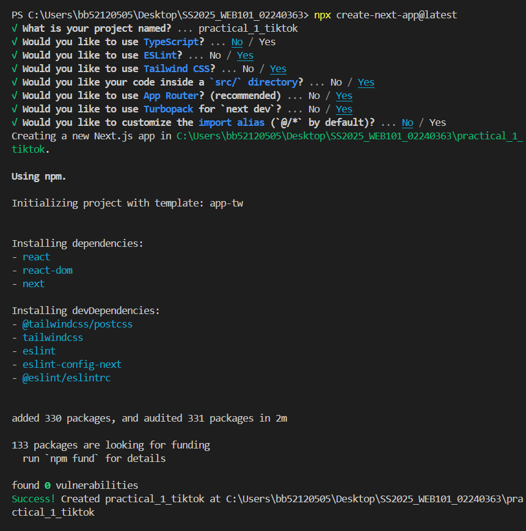
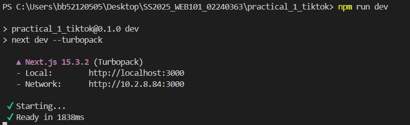
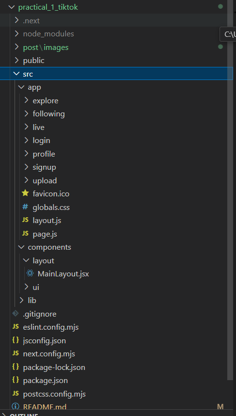

# TikTok Clone

A modern web application inspired by TikTok, built with **Next.js**, **React Query**, **Tailwind CSS**, and **context-based authentication**. This project demonstrates scalable frontend architecture, optimized data fetching, and responsive UI styling.

---

## 🛠️ Instructions

### Part 1 - Getting Started

#### Step 1: Navigate to Your Project Directory
Open your terminal and navigate to your GitHub repository directory.

#### Step 2: Create a New Next.js Project
```bash
npx create-next-app@latest

## solution 


### Step 3: Clean Up the Default Project
Navigate to src/app
Replace contents of page.js with a basic component
Clean up globals.css to retain only:

@import "tailwindcss";

Step 4: Set Up Project Structure
mkdir -p src/components/layout
mkdir -p src/components/ui
mkdir -p src/lib
mkdir -p src/app/profile
mkdir -p src/app/upload

Step 5: Create Basic Layout Components
Create src/components/layout/MainLayout.jsx and include navigation links.

Step 6: Update layout.js in the App Directory
Modify src/app/layout.js to use your custom layout.

Step 7: Create Basic Pages for Navigation
Create the following files:

src/app/profile/page.jsx

src/app/upload/page.jsx

Step 8: Start the Development Server


Part 2 - Creating the Web Layout and Main Interface
Objectives:
Sidebar navigation

Main content area

Basic video feed layout

Placeholder video components

Step 1: Install Additional Dependencies
npm install react-icons

Step 2: Update Layout Structure
Update src/components/layout/MainLayout.jsx to match TikTok’s sidebar layout.

Step 3: Create a For You Page Component
File: src/components/ui/VideoCard.jsx

Step 4: Create a VideoFeed Component
File: src/components/ui/VideoFeed.jsx

Step 5: Update the Home Page
Modify src/app/page.js to include VideoFeed

Step 6–8: Add More Pages
Create these files:

src/app/following/page.jsx

src/app/explore/page.jsx

src/app/live/page.jsx

Step 9: Update Upload Page
Update contents of:

src/app/upload/page.jsx

Step 10: Update Profile Page
Update contents of:

src/app/profile/page.jsx

Step 11: Test Your Application
Ensure all pages and navigation work as intended.

##Part 3 - Creating Login and Registration Forms

Objectives:
Login and signup pages

Form validation

Navigation links

Understand form concepts

🧠 Key Concepts
1. React Hook Form
Manage form state and validation:

register, handleSubmit, watch, errors

2. Form Validation
required, pattern, minLength, validate

3. Form Submission
onSubmit handles loading, sending data, and response.

4. Loading States
Prevents multiple submissions with visual feedback.

5. Form Error Handling
Validation messages shown under each input.

Step-by-Step Form Setup
Step 1: Install React Hook Form

npm install react-hook-form
Step 2: Create Login Page
File: src/app/login/page.jsx

Step 3: Create Signup Page
File: src/app/signup/page.jsx

Step 4: Update MainLayout Component
Update src/components/layout/MainLayout.jsx:

Change 1: Add Login link in the Sidebar

Change 2: Add Login button in the Header

### Project structure

