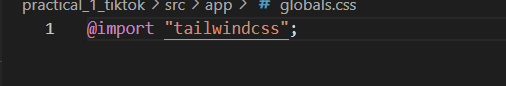

# TikTok Clone
## 1. Documentation 
Describe the main concepts you applied.

### Main Concepts Applied
1. Component-Based Architecture (React)
You broke down the interface into reusable components like MainLayout, VideoCard, and VideoFeed, making the UI modular and maintainable.

2. Client-Side Routing (Next.js App Router)
You used Next.js App Router to handle routing between pages like /profile, /upload, /login, and /signup, allowing for a seamless single-page application experience.

3. Tailwind CSS for Styling
Applied a utility-first CSS framework to rapidly design a responsive and visually consistent UI with minimal custom CSS.

4. React Query for Data Fetching & Caching
Used @tanstack/react-query to manage server state efficiently with features like:

Caching and deduplication
Background data refetching
Stale data control

5. Context API for Global State (Authentication)
Implemented authentication logic using React’s Context API (AuthProvider), allowing login status and user data to be accessible across the app.

6. Form Management with React Hook Form
Created login and signup forms using React Hook Form, enabling:

Easy validation
Minimal re-renders
Clean, declarative code

7. Layout Composition
Used a shared layout structure (MainLayout) in layout.js to keep UI consistent across routes and encapsulate navigation logic.

8. Toast Notifications (React Hot Toast)
Integrated react-hot-toast to display feedback messages like login success or validation errors.

9. Directory-Based Organization
Organized code into logical folders (components, pages, styles, contexts), which is crucial for scaling larger applications.

## 2.Reflection
# Discuss what you learned. 
# What I Learned
1. Structuring Modern Web Applications
Gained hands-on experience structuring a scalable Next.js project using the App Router, organized file structure, and custom layouts.

Learned the importance of separating UI into reusable components for better maintainability.

 2. Rapid UI Development with Tailwind CSS
Understood how utility-first CSS simplifies styling.

Learned how to build responsive and consistent UIs without writing much custom CSS.

3. Efficient Data Fetching with React Query
Learned to manage server state using @tanstack/react-query, with caching, refetching, and stale data strategies.

Saw how query hooks simplify async data flows without manual state management.

 4. Global State Management with Context API
Implemented an authentication system using React's Context API, allowing secure and centralized access to user state.

5. Building & Validating Forms with React Hook Form
Learned to build forms with real-time validation, error handling, and loading states.

Explored advanced features like watch, register, and custom validators.

6. Navigation and Routing
Gained practical experience with Next.js routing, creating multiple dynamic and static pages (e.g., /profile, /upload, /login).

Learned how to implement shared layouts across routes.

7. UX Feedback with Toast Notifications
Used react-hot-toast to provide user-friendly feedback for actions like login, logout, and form submission errors.

 8. Project Organization & Best Practices
Understood how to organize components, structure files, and follow best practices for readability and scalability.

Learned to initialize, clean, and configure a Next.js + Tailwind CSS project from scratch.

## Overall
This project helped me bridge the gap between theoretical knowledge and real-world application development. I now feel more confident working with React ecosystems, building responsive UIs, and managing application state effectively.

# Mention any challenges you faced (include screenshots) and how you overcame them.

1. Tailwind CSS Not Applying Styles
Problem:
After setting up Tailwind CSS, some utility classes were not applying styles as expected.

Cause:
The globals.css file was not properly importing Tailwind’s base styles.

Solution:
I fixed this by making sure the @import "tailwindcss"; line was correctly included at the top of globals.css.

2. React Hook Form Validation Not Triggering
Problem:
Form validations weren’t triggering on submit for login/signup pages.

Cause:
I missed the onSubmit={handleSubmit(onSubmit)} binding in the <form> tag.

Solution:
Corrected the form element:

<form onSubmit={handleSubmit(onSubmit)}>
