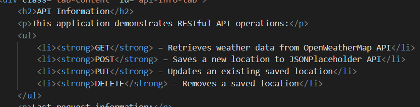
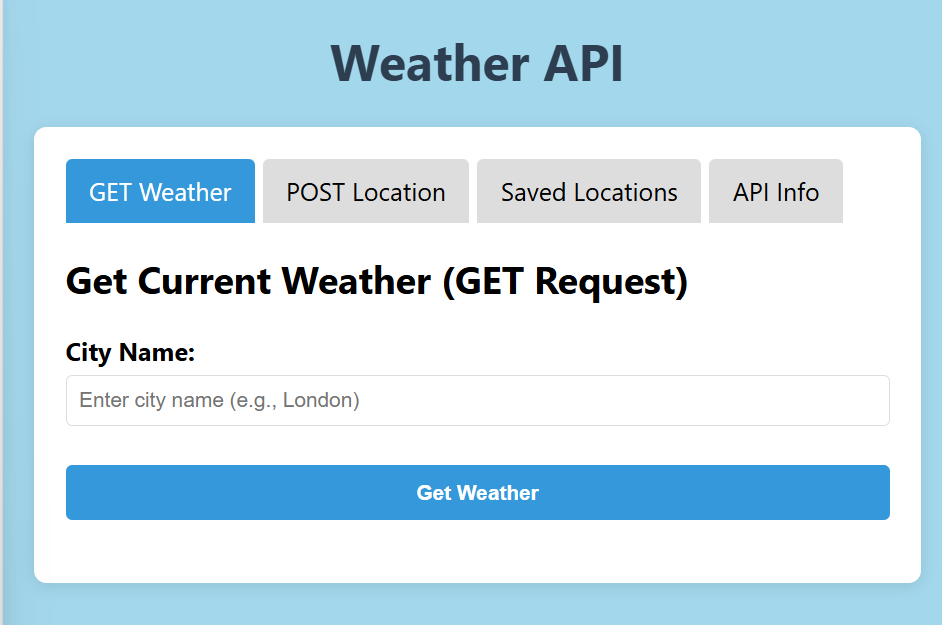
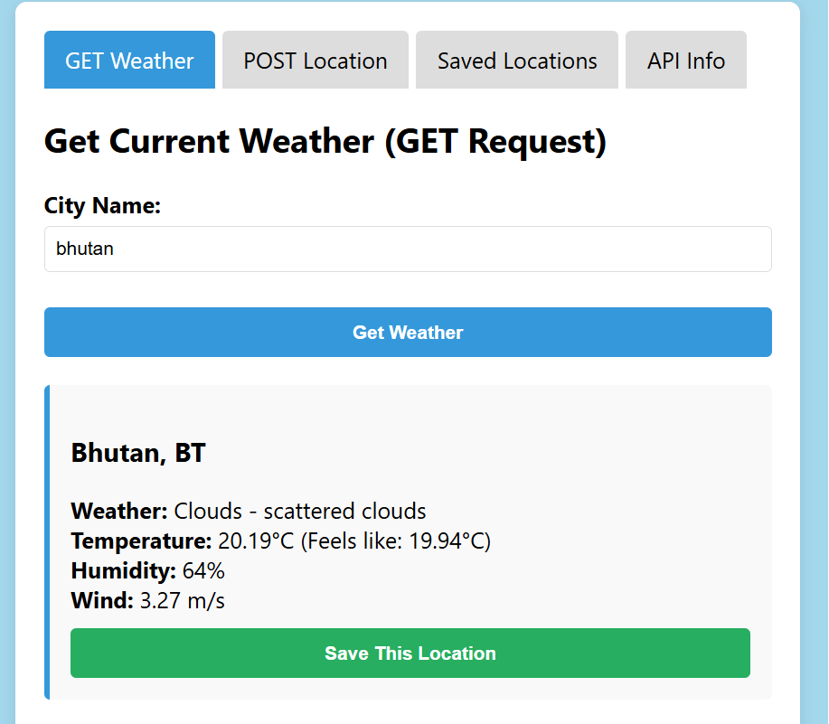

# RESTful API Weather Application  
## 1. Documentation 
### main concept applied 

The main concept applied in this project is consuming RESTful APIs using JavaScript (Fetch API) to perform the four primary HTTP methods—GET, POST, PUT, and DELETE—through a simple web interface.

Here's a breakdown of the concepts used:

1. RESTful API Operations
GET: Retrieve weather data from OpenWeatherMap API based on user input (city name).

POST: Create a new "location" resource using JSONPlaceholder (simulated API).
PUT: Update an existing location entry using its ID.
DELETE: Remove a location by ID.

 2. Event-Driven Programming
JavaScript listens for form submissions and button clicks.
On these events, it triggers asynchronous functions to make HTTP requests.

 3. Fetch API & Promises
Used to communicate with external APIs.
Supports all HTTP methods and handles asynchronous operations via async/await.

 4. DOM Manipulation
Dynamically updates the HTML to show API responses.
Enables tab switching and form processing in the browser without reloading.

 5. UI/UX Design Basics
Tabbed navigation for clean separation of functionality.
Basic form inputs and styled response areas for user feedback.

## 2.Reflection
# Discuss what you learned. 
# What I Learned

Working on this project taught me how to effectively interact with RESTful APIs using JavaScript. Here are the key things I learned:

1. How REST APIs Work
I gained a practical understanding of how different HTTP methods—GET, POST, PUT, DELETE—map to actions like retrieving, creating, updating, and deleting data. I learned how APIs expose endpoints that accept requests and return responses in JSON format.

 2. Using the Fetch API in JavaScript
I learned to use the fetch() method to send HTTP requests and handle responses using async/await. This included setting request headers, converting JSON data, and handling errors gracefully.

# Mention any challenges you faced (include screenshots) and how you overcame them.

# Tab UI and DOM Updates
Switching between tabs and keeping the UI updated correctly required careful DOM manipulation. A small mistake could prevent a form from being displayed or updated properly.

# Solution:
I created a simple showTab() function that hides all tabs and only shows the selected one. I also ensured that all form elements were correctly linked to JavaScript event listeners to update the UI based on API responses.

